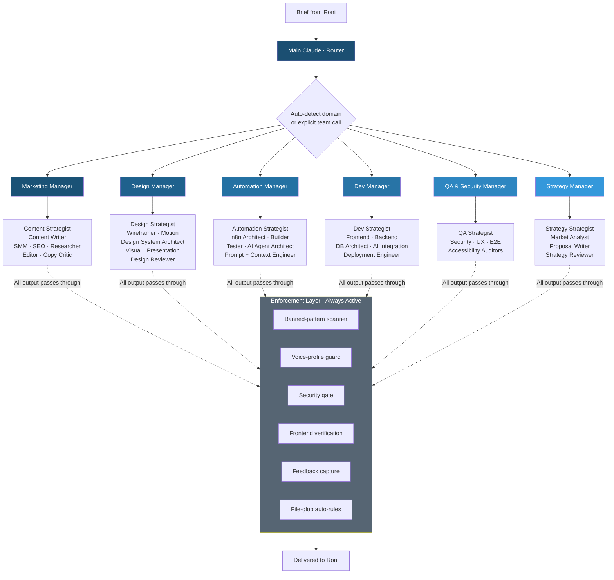

# Claude Code Multi-Team Agency Operating System

**A six-team AI workforce running inside Claude Code. Manager playbooks, specialist sub-agents, 30+ custom slash commands, deterministic hooks, and shared memory. Built as a single operating system for an agency of one.**

| | |
|---|---|
| **What it is** | Personal AI workforce of six specialist teams, each with its own manager playbook, dispatch routing, and purpose-built sub-agents |
| **Stack** | Claude Code · Anthropic API · MCP servers · slash commands · sub-agents · hooks · plugins · file-glob auto-loading rules |
| **Scale** | 6 teams · 30+ slash commands · 40+ specialist sub-agents · hook layer for deterministic enforcement |
| **Use case** | One-person consultancy operating with the dispatch model of a full agency |

---

## The Problem

Working alone meant context-switching constantly. Marketing copy in the morning, n8n workflow design at lunch, design review in the afternoon, security audit before bed. Each domain has its own voice, its own quality bar, its own way of failing. Without structure, every task started from scratch, and quality drifted because no single context could hold every department's standards at once.

Generic Claude Code use only got me so far. The model is capable, but a freelancer working solo needs the model to behave like an agency. Different specialists for different briefs, different reviewers for different domains, different memory for different brands, and a routing layer that decides who picks up what.

## The Solution

I designed and built a six-team operating system on top of Claude Code. Each team has a Manager playbook, a roster of specialist sub-agents, its own quality gates, and its own memory. A router sits in front and dispatches every brief to the right team. Deterministic hooks enforce rules that prompts can drift away from. The architecture itself reads as a curriculum for anyone trying to operate Claude Code at scale.

---

## How It Works

### Architecture Overview

---

## The Six Teams

### Marketing
Content strategy, copy, social, SEO, research. Writers hand drafts to an Editor sub-agent in a separate context (no self-review). A Copy Critic runs a pre-flight smell test before drafts reach the Editor.

### Design
Strategist routes briefs (design system, wireframe, motion, visual, presentation). Specialists include a Design System Architect (tokens, components, accessibility), a Wireframer (ASCII page wireframes + Mermaid flows), a Motion Designer (GSAP + View Transitions), and a Design Reviewer (independent QA on specs before implementation).

### Automation
n8n workflow construction via the official n8n MCP. The Architect designs the spec, the Builder implements via the n8n SDK, the Tester stress-tests with pin data. Hard rules baked in: native nodes first, one canvas per project, AI agent cost discipline (max iterations, max tokens, max wall-clock).

### Development
Strategist detects the stack, picks a workflow (design, plan, build, review, ship, AI integration), and assigns specialists. Frontend, Backend, DB Architect, AI Integration Engineer, and Deployment Engineer all hand reviews to QA, never review their own work.

### QA & Security
Security Auditor (OWASP Top 10, secrets, auth), UX Auditor (7-dimension live audit), E2E Tester (headed Playwright, strict grading, any skip or partial pass fails the suite), Accessibility Auditor (WCAG 2.1 AA).

### Strategy
Strategist picks the framework (Porter, SWOT, Ansoff, JTBD, Blue Ocean) and the workflow. Market Analyst handles competitive research with cited claims. Proposal Writer owns client proposals and pitch deck specs with stated win themes. Strategy Reviewer runs independent fresh-eyes critique.

---

## The Enforcement Layer

Rules in prompts drift. Rules in code do not. So the system has a layer of deterministic hooks and file-glob auto-rules sitting underneath every team:

- **Banned-pattern scanner.** Blocks output containing AI-slop words (the obvious offenders plus em dashes and 20+ others) before it reaches the user.
- **Voice-profile guard.** When editing copy files, the appropriate brand voice profile is loaded and enforced.
- **Security gate.** Secrets in commits, hardcoded API keys, and known-bad patterns are flagged before push.
- **Frontend verification.** Any user-facing change must have a working route, a rendered component, and a navigation path. "API works but no UI" is not done.
- **Feedback capture.** When I correct an approach, the system prompts to save it as a feedback memory so it does not repeat.
- **File-glob auto-rules.** Open a Tailwind config and the design-system rule loads. Open a test file and the test-quality rule loads. Rules attach to file types, not to manual context dumps.

---

## Memory Architecture

Three layers of memory keep the system coherent across sessions:

1. **Global CLAUDE.md.** Always-loaded, holds the agency router, durable preferences, and team dispatch logic.
2. **Team playbooks.** Read on demand by Managers, contain orchestration logic, specialist roster, workflows, quality gates.
3. **Per-project auto-memory.** User, feedback, project, and reference memories are saved to a project-scoped folder and replayed on every new session in that directory.

The result is that a session in the Job Hunt repo knows things about my IELTS teaching history, my SMTB framing rules, and my preferred filter thresholds, without me ever re-stating them.

---

## What Makes This Different

This is not a list of prompts. It is an operating system. The pieces that matter:

- **Dispatch routing, not chat routing.** A brief lands and goes to the right team with the right specialists. The router is its own context. The specialists run in their own contexts. No reasoning bleed.
- **Independent review by default.** Every quality gate dispatches a reviewer sub-agent in a separate context. Same separation-of-concerns pattern that consulting firms apply to engagement review.
- **Deterministic over advisory.** Hooks enforce rules that prompts forget. The banned-pattern scanner does not negotiate.
- **Memory that survives sessions.** Auto-memory persists user preferences, feedback corrections, and project state across every conversation in the same project.
- **The architecture is itself a teaching artifact.** Any team adopting Claude Code at scale would build something close to this. That is why it doubles as the proof-point for training engagements: read the system, see how a non-engineering team should operate the tool.

---

## What I Use It For

Day-to-day: copy, wireframes, n8n workflows, full-stack app development, security review, proposal drafting, market research, competitive analysis. Every domain my solo consultancy touches has a team and a Manager and a quality gate. I run a one-person agency with the dispatch model of a forty-person one.

---

*Built by [Roni Ravikumar](https://www.linkedin.com/in/roni-ravikumar-727a8a1a5) · Claude Code · architecture and approach shared, source kept private.*
