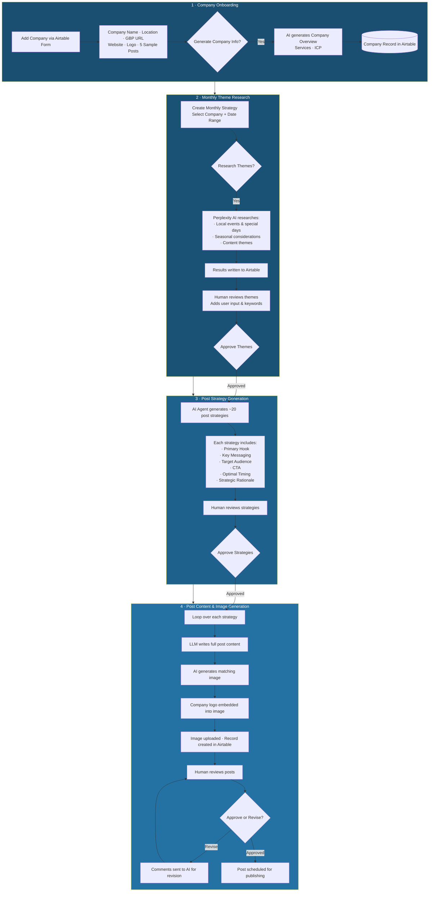

# GMB Content Creator Agent

**Autonomous AI system that researches, writes, and generates Google My Business posts — at scale.**

| | |
|---|---|
| **Impact** | Saves **90+ hours/month**, manages **80+ client profiles** |
| **Stack** | n8n · OpenRouter · Perplexity AI · Airtable · Image Generation |
| **Built for** | Digital agency serving restoration & service businesses across the US |

---

## The Problem

The agency managed Google My Business profiles for 80+ client locations. A full-time employee was dedicated to manually researching topics, writing posts, generating images, and scheduling content — every single month, for every single profile. It was repetitive, time-consuming, and didn't scale.

## The Solution

I built an end-to-end AI agent system in n8n that automates the entire content pipeline — from theme research to post generation to image creation — with human review checkpoints at every stage.

---

## How It Works

### Architecture Overview

---

## The Pipeline in Detail

### 1. Company Onboarding
Each client is added via an Airtable form: company name, location, address, website URL, Google Business Profile URL, logo, and 5 sample posts that represent the client's voice and tone. A checkbox triggers an AI agent (via OpenRouter) to automatically generate a company overview, list of services, and ideal customer profile (ICP) — all stored back in Airtable.

### 2. Monthly Theme Research
A monthly strategy record is created per company. When "Research Themes" is triggered, the system uses **Perplexity AI** to research the company's local area — pulling in upcoming local events, seasonal considerations, and relevant content themes for that month. Results are written to Airtable for human review. The user can add specific focus areas (e.g., "Focus on fire damage and water damage") and target keywords before approving.

### 3. Post Strategy Generation
Once themes are approved, an **AI Agent** generates approximately 20 detailed post strategies (the client wanted 15 per month — the extra provides a margin of error and selection flexibility). Each strategy includes a primary hook, key messaging, target audience, CTA, optimal posting date, and strategic rationale tied to the research themes.

### 4. Post Content & Image Generation
After strategies are approved, the system loops through each one:
- An **LLM generates the full post content** — written in the client's voice using the sample posts as style reference
- An **AI image generator creates a relevant visual** for each post
- The **company logo is automatically embedded** into the generated image
- The final post (content + image) is written to Airtable as a new record with a scheduled publish date

### 5. Human Review & Revision Loop
Every generated post goes through a review step. Posts can be approved directly or sent back with revision comments — which are fed back into the AI for another pass. This ensures quality while keeping the human in the loop without the human doing the heavy lifting.

---

## Results

- **80+ client profiles** managed through a single system
- **~90 hours/month saved** — eliminated the need for a full-time content employee
- **20 strategies + posts generated per company per month** with full image assets
- **Human-in-the-loop at every stage** — research, strategy, and content all reviewed before publishing
- **Revision workflow** handles feedback without manual rewriting

---

## What I Learned

This was the project that taught me how to think in systems rather than tasks. The hardest part wasn't the AI — it was designing the Airtable data model so that 80+ companies, each with monthly strategies, each with 20 posts, each with images and review states, all stayed organised and navigable. The AI is the engine, but the architecture is what makes it work at scale.

---

*Built by [Roni Ravikumar](https://www.linkedin.com/in/roni-ravikumar-727a8a1a5) · n8n workflow — architecture and approach shared, source kept private.*
