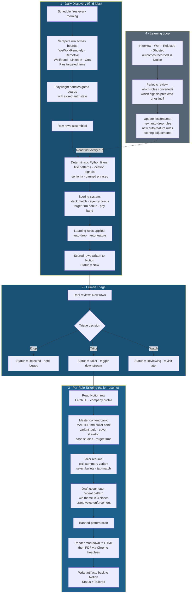

# Job Hunt Operating System

**An end-to-end agentic system for finding remote roles, scoring them deterministically, tailoring resumes and cover letters per role, and writing it all back to Notion. Built entirely in Claude Code.**

| | |
|---|---|
| **What it is** | Personal job-hunt pipeline that runs discovery, scoring, tailoring, and tracking as one operating system |
| **Stack** | Claude Code · Python · Notion API · MCP · Playwright · Firecrawl · OpenRouter |
| **Slash commands** | `/find-jobs` (daily discovery) · `/tailor-resume` (Notion row to application package) |
| **Status** | Active. Feeds my own pipeline every day. |

---

## The Problem

Job-hunting as a senior operator means filtering signal from a flood of noise. Job boards repeat the same listings. Most "remote" roles are remote-in-one-country. Application volume only matters if every application is tailored. And tailoring 30 applications a week by hand is its own full-time job.

I needed a system that did the boring parts (search, score, drop the bad ones, write to a tracker) and the precise parts (read the JD, pick the right resume variant, draft a cover that lands the win theme in three places) so I could spend the saved time on actual conversations.

## The Solution

I built a two-command operating system in Claude Code. `/find-jobs` runs every morning. Scrapes boards I trust, applies deterministic filter and scoring rules, writes scored rows to a Notion database. `/tailor-resume` runs per row. Reads the JD, pulls bullets from a master content bank, generates a tailored resume and cover letter, renders them to PDF, and writes the artifacts back to Notion. A learning loop hardens the filter rules from interview outcomes over time.

---

## How It Works

### Architecture Overview

---

## The Pipeline in Detail

### 1. Daily Discovery

A scheduled `/find-jobs` run hits every board I trust. Some are open (WeWorkRemotely paid tier, Remotive RSS). Some are gated (Wellfound, LinkedIn) and need Playwright with persistent auth state. Some require fetching via Firecrawl when the board has no usable feed.

Raw rows feed into a deterministic Python filter pipeline. No LLM at this stage. Speed and reproducibility matter more than judgment:

- **Title patterns.** Engineering-title regex auto-drops anything labeled "Software Engineer," "Backend Engineer," and similar (not my positioning).
- **Location signals.** "Remote, US-only" drops. "Remote, India OK" keeps. "Remote" with no country qualification flags for triage.
- **Seniority.** Entry-level patterns auto-drop. Mid-to-senior keeps.
- **Banned phrases.** Known scam patterns drop.

Surviving rows go to a scoring system. Stack-match bonus for keywords aligned with my actual work. Agency bonus when the hiring company is on my known-good firms list. Target-firm bonus for a hand-curated list. Pay band parsed where stated.

Then the learning layer runs. A `lessons.md` file holds hardened auto-drop and auto-feature rules. Patterns the system has learned from past interview outcomes. New rules added every few weeks. Old rules retired when they stop firing.

Scored rows land in Notion with `Status = New`.

### 2. Human Triage

I look at the new rows once a day. Drop, tailor, or watch. The triage is the only step a human owns end-to-end. Every other step the system runs.

### 3. Per-Role Tailoring

When a row flips to `Status = Tailor`, `/tailor-resume` picks it up:

- Reads the full JD and company profile from the Notion row
- Pulls the right summary variant from a tagged bullet bank (operator, builder, trainer, full-stack, depending on JD signal)
- Selects bullets by tag-match against JD keywords
- Drafts the cover letter using a 5-beat canonical pattern (hook, why this firm, why me, proof, close), with the win theme woven through three places
- Enforces banned patterns (no em dashes, no "I hope this finds you well," no AI-slop words)
- Enforces voice profile (Wordwise stacked-fragment style for high-stakes covers, plain operational tone for cold outreach)
- Renders markdown to HTML to PDF via a custom design system (Space Grotesk + Inter, violet accent, two-page maximum)
- Writes the resume PDF, cover letter, and a one-line summary back to the Notion row
- Flips `Status = Tailored`

The whole step takes about 90 seconds per role.

### 4. Learning Loop

After interview outcomes are recorded in Notion (Interview, Won, Rejected, Ghosted), a periodic review checks: which signals predicted positive outcomes? Which predicted ghosting? Those become new rules in `lessons.md`. `/find-jobs` reads `lessons.md` first on every run, so the filter rules sharpen with use.

---

## What Makes This Different

- **Deterministic where it counts.** Discovery filtering does not run through an LLM. Same query, same output, every time. Reproducible debugging beats clever scoring.
- **LLM where it actually helps.** Tailoring is the only place generative work happens, and it is constrained by a bullet bank and voice profile so the model is choosing from approved content, not inventing it.
- **Notion as the database, not the UI.** The UI is whatever surface Notion gives me. The "app" is the slash commands and the scrapers.
- **Memory hardens the system.** Every correction I make to a filter or scoring rule lands in `lessons.md`. Every cover-letter pattern that worked lands in `COVER_LETTER_EXAMPLES.md`. The system gets sharper over time without me retraining anything.
- **Built as an architecture proof.** This is also a public artifact. Anyone who wants to see how an operator uses Claude Code at scale can read the repo. Slash commands, memory architecture, MCP integration, Playwright auth flow, deterministic-vs-generative split, all visible.

---

## What I Use It For

Every weekday. A morning scan of new rows, a triage pass, two or three tailored applications, occasional manual outreach. The system handles 80% of the work. I handle the 20% that needs judgment.

The architecture is the same one a consultant would adopt to ship internal tooling. That is the point. It is a personal pipeline AND a demonstration of how to operate Claude Code as a workforce on a real, daily problem.

---

*Built by [Roni Ravikumar](https://www.linkedin.com/in/roni-ravikumar-727a8a1a5) · Claude Code · Python · Notion API · architecture and approach shared, source kept private.*
