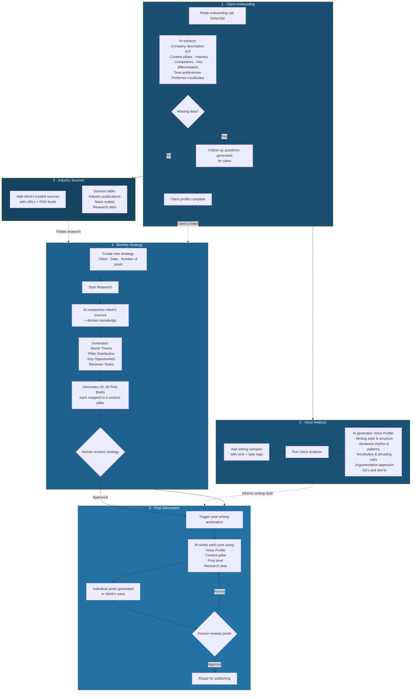

# LinkedIn Content Generator

**AI system that turns a single onboarding call into months of voice-matched, research-backed LinkedIn posts — written in the client's exact tone and style.**

| | |
|---|---|
| **Impact** | Generates **20–30 posts/month per client**, each research-backed and voice-matched |
| **Stack** | n8n · OpenRouter · Airtable · Web Sources / RSS |
| **Built for** | Digital agency offering LinkedIn thought leadership as a service (Suncoast Interactive) |

---

## The Problem

Thought leadership on LinkedIn is high-effort. Each post needs to sound like the person writing it, reference real industry developments, and align with a coherent content strategy. For agencies managing this on behalf of busy professionals, the bottleneck is always the same: you can't scale voice.

A writer can maybe handle 2–3 clients before the quality drops. Research takes hours. And the client always says "this doesn't sound like me."

## The Solution

I built a system that captures a client's voice from a single onboarding transcript, learns their writing style from samples, monitors their industry sources, and generates fully researched, voice-matched LinkedIn posts at scale — with strategy, pillar distribution, and review built in.

---

## How It Works

### Architecture Overview

---

## The Pipeline in Detail

### 1. Client Onboarding (One Call → Full Profile)

The process starts with a single onboarding call. The raw transcript is pasted into an Airtable form (Name, Company, Transcript), and AI parses it into structured data:

- **Company Description** — what the business does, where it operates, how it positions itself
- **ICP** — ideal customer profile, who the content is targeting
- **Content Pillars** — the 3–5 core themes the client should own on LinkedIn
- **Industry, Competitors, Key Differentiators** — market context
- **Tone Preferences & Preferred Vocabulary** — how the client naturally speaks
- **Extraction Confidence** — how complete the data is (e.g., "5/5 required fields extracted")
- **Follow-Up Questions** — if the transcript is missing key info, the AI generates specific questions to ask the client

For example, a client like *Victoria from Transcendens Law* gets a profile that captures everything from "fractional General Counsel for Georgia businesses" to "agricultural and real estate law for Georgia landowners" to messaging pillars like "proactive risk management" and "building business-legal partnerships beyond traditional reactive lawyering."

### 2. Voice Analysis

Once writing samples are added (tagged by tone and type — e.g., "authoritative / linkedin_post"), clicking **Run Voice Analysis** triggers an AI that studies the samples and produces a detailed **Voice Profile**:

- Writing style and structure patterns
- Sentence rhythm (short declarative punch → longer explanatory sentence → short payoff)
- Vocabulary rules (what words to use, what to avoid)
- Argumentation approach (problem-then-solution, myth-busting, etc.)
- Specific do's and don'ts for the writer AI

This Voice Profile becomes the style guide that every generated post is written against. The result: posts that actually sound like the client wrote them, not like AI generated them.

### 3. Industry Sources

The client's trusted information sources — industry publications, legal news sites, trade associations, research outlets — are added to a Sources table with URLs and RSS flags. These become the research foundation that keeps generated content timely, relevant, and grounded in real developments.

For example, a law firm client might list: Today's General Counsel, JD Supra, Bloomberg Law, Georgia Farm Bureau.

### 4. Monthly Strategy Generation

Each month, a new strategy is created: select the client, set the date, and specify the number of posts needed. Clicking **Start Research** triggers the AI to:

1. **Research the client's sources** for current developments, news, and opportunities
2. **Generate a Month Theme** — the overarching narrative for the month (e.g., "Georgia businesses face a regulatory inflection point in 2026 — tort reform, tax cuts, and agricultural policy shifts create immediate opportunities")
3. **Create a Pillar Distribution** — how many posts per content pillar (e.g., "Proactive risk management": 10, "Agricultural law": 8, "Strategic dispute resolution": 4)
4. **Identify Key Opportunities** — timely topics with high relevance to the client's ICP
5. **Write Notes for Reviewer** — quality assessment and recommendations
6. **Generate 20–30 Post Briefs** — each with a headline, brief number, and assigned content pillar

The briefs are specific and research-grounded. For example: "Georgia's SB 68 tort reform changes premises liability fault apportionment with unintended plaintiff advantage" or "USDA bridge assistance delivers up to $132.89 per acre for Georgia rice and cotton producers with strict documentation requirements."

### 5. Post Generation

Once the strategy is reviewed and approved, triggering the automation writes each individual post using:

- The **Voice Profile** (how to write)
- The **Content Pillar** (what theme)
- The **Post Brief** (what specific topic)
- The **Research Data** (what facts and sources to reference)

Each post is written in the client's exact voice and style, structured according to the patterns identified in the voice analysis, and grounded in real, current industry developments.

---

## What Makes This Different

- **Voice capture from a transcript** — one onboarding call gives the AI everything it needs to understand the client's business, positioning, and content strategy. No lengthy questionnaires or weeks of back-and-forth.
- **True voice matching** — the Voice Analysis doesn't just note "professional tone." It captures sentence rhythm, argumentation patterns, vocabulary preferences, and phrasing rules. The output reads like the client, not like AI.
- **Research-grounded content** — posts aren't generated from generic knowledge. They're built on the client's own trusted sources, making every post timely and credible.
- **Pillar-based strategy** — content isn't random. Each month's posts are distributed across the client's content pillars with intentional weighting, creating a coherent thought leadership presence over time.
- **Scales per client, not per writer** — adding a new client is an onboarding call, a few writing samples, and a list of sources. From there, the system generates months of content.

---

*Built by [Roni Ravikumar](https://www.linkedin.com/in/roni-ravikumar-727a8a1a5) · n8n workflow — architecture and approach shared, source kept private.*
