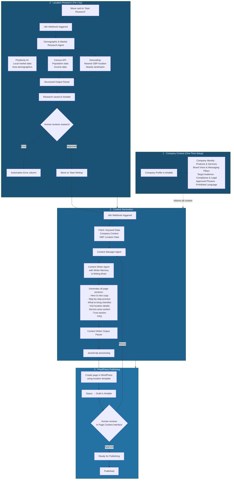

# Location Pages Writer

**AI-powered system that researches, writes, and publishes SEO-optimised location pages at scale — complete with demographic research, compliance guardrails, and direct WordPress publishing.**

| | |
|---|---|
| **Impact** | Saved **600+ hours** of developer and writer time · **611+ location pages** generated |
| **Stack** | n8n · OpenRouter · Perplexity AI · Census Data · Airtable · WordPress |
| **Built for** | Financial services company with 35+ locations across Texas |
| **Timeline** | Delivered in **2 months**, working part-time |

---

## The Problem

The client operated 35+ physical locations across Texas and needed unique, SEO-optimised landing pages for hundreds of city + service combinations (e.g., "Payday Loans in Arp, TX", "Cash Advance in Balcones Heights, TX"). Each page needed to be locally relevant, on-brand, legally compliant with Texas lending regulations, and structured for conversion.

Doing this manually would have required a writer, a researcher, and a developer working full-time for months. The pages also needed to follow strict brand voice guidelines and include legally required disclaimers — meaning every page had to be accurate, not just generated.

## The Solution

I built a multi-agent AI system in n8n that handles the full pipeline: demographic research per location, intelligent content generation with brand voice and compliance awareness, and direct page creation in WordPress — all orchestrated through an Airtable dashboard with human review at every stage.

---

## How It Works

### Architecture Overview

---

## The Pipeline in Detail

### 1. Company Context (One-Time Setup)

Before generating a single page, I built a comprehensive company context document in Airtable that the AI references for every piece of content. This includes:

- **Company Identity** — legal name, business type, years in business, number of locations
- **Product Offerings** — detailed breakdown of each loan type (features, eligibility, key terms) and critically, products the company does NOT offer
- **Brand Voice** — tone profile, voice characteristics, key messaging pillars (Speed, Trust, Accessibility, Local Presence), power words to use, approved phrases
- **Compliance & Legal** — Texas lending law requirements, required disclaimers, prohibited language, fair lending principles, "must do" and "never do" rules for content

This context acts as the AI's "brain" — ensuring every generated page is on-brand, legally compliant, and factually accurate regardless of which location it's writing for.

### 2. Location Research (Per City)

Each location card starts in "Not Started" on the Airtable Kanban dashboard. When moved to "Start Research", an n8n webhook fires and triggers the **Demographic & Market Research Agent**, which:

- Queries **Perplexity AI** for local market conditions, area characteristics, and relevant demographic context
- Pulls **census data** for population statistics and income demographics
- **Geocodes the city** to find the nearest physical GBP (Google Business Profile) location and nearby landmarks

All research is parsed through a structured output parser and saved to Airtable. The card moves to "Research Review" for human verification — or to "Automation Error" if something fails.

### 3. Content Generation

Once research is approved and the card moves to "Start Writing", another webhook triggers the content pipeline:

1. **Data assembly** — fetches keyword targeting data, the full company context, and the nearest GBP location details
2. **Content Manager Agent** — orchestrates the writing process, ensuring all sections are generated and consistent
3. **Content Writer Agent** — the actual writer, equipped with a **Writer Memory** (for consistency across pages) and a **Writing Brain** (the company context + brand voice rules). Generates every section of the page:
   - Hero headline and intro copy (localised to the city)
   - Step-by-step "How It Works" process
   - "What to Bring" checklist
   - Visit Location section (with nearest landmarks and distance)
   - Service Area content
   - Trust section (licensed, regulated, transparent)
   - FAQ section
4. **Output Parser + JavaScript** — structures the content and prepares it for WordPress

### 4. WordPress Publishing

The processed content is pushed directly to WordPress via API, populating a pre-built page template with the generated content. The template includes dynamic placeholders for every section — hero, steps, trust signals, FAQ, "We Also Service" grid of nearby locations, and CTAs.

The Airtable status updates to "Draft". A human can then review the page in the **Page Content interface** (a custom Airtable view showing all generated sections side by side), approve it, or send it back for revision. Approved pages move to "Ready for Publishing" and then "Published".

---

## Scale

- **611+ location pages** tracked in the dashboard at peak
- Each page includes **unique, locally researched content** — not just city-name swaps
- Pages cover multiple loan types per location (Payday Loans, Cash Advance, Title Loans)
- Every page is **legally compliant** with Texas lending regulations
- The entire system was **delivered in 2 months, working part-time** — saving an estimated **600+ hours** of combined developer, writer, and researcher time

---

## What Makes This Different

This isn't a simple "mail merge with AI" system. What makes it work at scale:

- **Deep company context** — the AI doesn't just know the company name; it knows the brand voice, the compliance rules, the prohibited language, and the exact product details. This is what separates usable output from generic AI content.
- **Real research per location** — every page is backed by actual demographic data and local market context, not hallucinated filler.
- **Multi-agent architecture** — a Content Manager coordinates the Content Writer, which has its own memory and brain. This produces structurally consistent pages while keeping the content locally relevant.
- **Human-in-the-loop at two stages** — research review and content review. The AI does the heavy lifting, but a human catches edge cases.
- **Direct WordPress publishing** — content doesn't sit in a spreadsheet waiting for a developer. It goes straight into the live template.

---

## Sample Output

📄 [View a live location page (PDF)](samples/sample-location-page-live.pdf) · [View the WordPress template (PDF)](samples/sample-location-page-template.pdf)

A completed location page includes:

- Localised hero headline and city-specific intro
- 5-step "How It Works" process with details specific to the loan type
- "What to Bring" checklist
- "Visit Location" section with nearest landmarks and directions
- Service area description covering surrounding communities
- Trust section (licensed, regulated, no hidden fees)
- FAQ section
- "We Also Service" grid linking to nearby location pages
- Conversion CTAs throughout

---

*Built by [Roni Ravikumar](https://www.linkedin.com/in/roni-ravikumar-727a8a1a5) · n8n workflow — architecture and approach shared, source kept private.*
