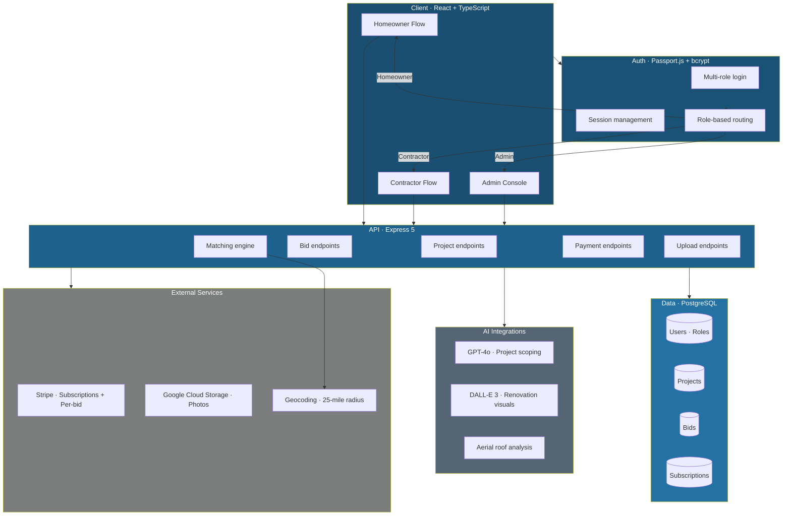

# Show Me The Bids

**A two-sided marketplace connecting homeowners with licensed contractors for home renovation bids. Full product lifecycle from PRD to production-ready MVP, directed end-to-end through Claude Code. Currently in open beta.**

| | |
|---|---|
| **What it is** | Two-sided marketplace (homeowners + licensed contractors) with multi-role auth, subscriptions, geo-based matching, and AI-assisted project scoping |
| **Stack** | React · TypeScript · Express 5 · PostgreSQL · Stripe · Passport.js · Google Cloud Storage · OpenAI GPT-4o + DALL-E 3 |
| **Built via** | Directed end-to-end through Claude Code. Architecture, schema, API, frontend, payment integration, and deployment without hand-coding. |
| **Engagement** | Hired build. Full product lifecycle from PRD through production-ready MVP. |
| **Status** | Open beta |

---

## The Problem

Homeowners planning renovations face two frictions at the same time. They do not know what their project should cost, and they do not know which contractors near them are licensed, available, and worth their time. Contractors face the mirror problem. Leads come from everywhere, most are unqualified, and the time spent chasing tire-kickers eats the margin on real jobs.

The brief was to build a marketplace that fixed both sides at once. Pre-qualified contractors only, geo-filtered to a serviceable radius, with enough AI assistance at the project-creation step that homeowners arrive with a clear scope and a realistic budget. And contractors arrive at leads that are ready to bid.

## The Solution

A production-grade two-sided marketplace built end-to-end through Claude Code. Multi-role authentication routes users into homeowner or contractor flows from signup. Stripe handles both contractor subscriptions and per-bid charges. Geo-matching pairs homeowners with contractors inside a 25-mile radius. OpenAI assists at the project-creation step. GPT-4o helps homeowners scope the project in natural language, DALL-E 3 generates renovation visualizations, and aerial roof measurement runs as an analysis pass for roofing projects.

I directed the build through Claude Code. Architecture decisions, schema design, API contracts, frontend implementation, payment flows, image-handling pipeline, and deployment. No hand-coding the production source.

---

## How It Works

### Architecture Overview

---

## The Build in Detail

### Multi-Role Authentication

Passport.js with bcrypt-hashed credentials. Signup routes users into homeowner, contractor, or admin from the first step. Session middleware enforces role-based access on every protected endpoint. Homeowners cannot see contractor-only views, contractors cannot post projects, admins see everything. Authorization is checked at the route handler, not just at the middleware layer.

### Project Creation with AI Scoping

When a homeowner starts a new project, they describe the work in natural language. GPT-4o asks clarifying questions, structures the scope, suggests a budget range based on the description, and produces a clean project brief. For visual projects, DALL-E 3 generates a renovation visualization the homeowner can attach. For roofing-specific projects, an aerial roof analysis pass runs on the property address to estimate measurements.

The AI does not replace the homeowner's judgment. It compresses 30 minutes of "how do I even describe this" into 5 minutes of guided input.

### Geo-Matching at 25-Mile Radius

Once a project posts, the matching engine queries for licensed contractors inside a 25-mile radius of the project address. Distance is calculated against geocoded contractor service areas, not raw zip codes. Contractors outside the radius do not see the project. Contractors inside see it on their dashboard with the relevant project details and a one-click bid action.

### Stripe Billing, Two Pricing Models in One

Contractors carry a subscription (monthly or annual tier) that grants base platform access. On top of that, each accepted bid triggers a per-bid charge. Stripe handles both via separate products and metered usage. Webhook handlers verify signatures, idempotency keys prevent double-charging on retries, and failed payments downgrade access without losing user data.

### File Uploads via Google Cloud Storage

Project photos, contractor portfolio images, and AI-generated visualizations all route through Google Cloud Storage. Signed URLs handle upload from the client without proxying through the API server. Image metadata stays in PostgreSQL. Binary content stays in GCS.

### Bid Workflow

Contractor sees a project, submits a bid (price, scope, timeline). Homeowner reviews bids on their dashboard. Accepted bid triggers the Stripe per-bid charge and exchanges contact information between the two parties. Declined bids stay logged for the contractor's records. Bids expire after a configurable window if the homeowner does not respond.

---

## How It Was Built

This was directed end-to-end through Claude Code. The Dev Manager playbook routed the build across:

- **DB Architect** for the schema and RLS-equivalent role boundaries
- **Backend Engineer** for API surface design (REST endpoints with zod-validated request bodies)
- **Frontend Engineer** for React + TypeScript implementation with shadcn/ui components
- **AI Integration Engineer** for the GPT-4o and DALL-E 3 calls with prompt caching and explicit `max_tokens` caps
- **Deployment Engineer** for env config, secrets management, and post-deploy verification

Reviews ran as independent sub-agent dispatches. QA's E2E Tester ran headed Playwright on the full flows. Multi-role signup, project creation with AI scoping, contractor bid submission, Stripe payment, file upload. Strict grading throughout. Any skipped test or partial pass failed the suite.

The point is the workflow itself. A consultant or in-house team adopting Claude Code would build something the same way. Dispatch model, specialist sub-agents, independent review gates, hooks enforcing secrets and frontend verification.

---

## What Makes This Different

- **Two-sided marketplace with two pricing models in one Stripe integration.** Subscription plus per-action charges with idempotent webhook handling.
- **AI used precisely, not pervasively.** GPT-4o at the scoping step (high friction reduction), DALL-E 3 at the visualization step (concrete value), aerial roof analysis for roofing projects (domain-specific accuracy). No "let's add a chatbot everywhere."
- **Geo-matching that respects contractor service areas,** not just project zip codes. Real-world constraint.
- **Full production lifecycle through Claude Code.** PRD, schema, API, frontend, payments, file pipeline, deployment, E2E tests. Same agentic workflow pattern a consultant would adopt to ship internal tooling.

---

*Built by [Roni Ravikumar](https://www.linkedin.com/in/roni-ravikumar-727a8a1a5) · Directed end-to-end through Claude Code · architecture and approach shared, source kept private.*
